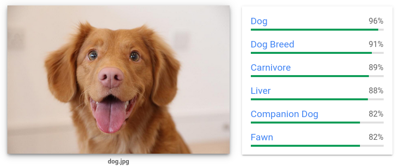

# Agregado Final: Reconocimiento de Imágenes

**Materia**: Taller de Programación.

Primer Cuatrimestre de 2024.

## Grupo: Rustic City Eye

### Integrantes

- Carranza, Lihuén.
- Demarchi, Ignacio.
- Giacobbe, Juan Ignacio.
- Saluzzi, Luca.

# Índice

1. [Introducción](#introducción)
2. [Proveedor de Infraestructura en la nube](#proveedor-de-infraestructura-en-la-nube)
    1. [Detalles y costos del proveedor](##detalles-y-costos-del-proveedor)
    2. [Uso del proveedor](##uso-del-proveedor)
3. [Aplicación de Monitoreo](#aplicación-de-monitoreo)
4. [Sistema Central de Cámaras](#sistema-central-de-cámaras)
5. [Software de Control de Agentes(Drones)](#software-de-control-de-agentesdrones)

# Introducción

Para este agregados, tuvimos que incorporar la tecnologia de reconocimiento de imagenes al sistema central de camaras desarrollado en nuestro proyecto de Agentes 
Autonomos de Prevencion. Esta tecnologia incorpora una inteligencia artificial que nos permite interpretar y comprender el contenido de imagenes digitales, utilizando algoritmos de aprendizaje automatico como las redes neuronales convolucionales, para identificar y clasificar objetos, y tambien para identificar caracteristicas visuales de nuestras imagenes.

Las aplicaciones de seguridad y vigilancia suelen servirse de esta tecnologia, debido a que podemos detectar ciertos eventos u objetos a traves de nuestros dispositivos de seguridad, y tomar medidas al respecto. Para nuestra aplicacion, tuvimos que hacer capaz al sistema central de camaras de procesar imagenes para detectar potenciales incidentes en la via publica(por ejemplo incendios, accidentes de transito, etc). Luego de detectar un incidente en las imagenes, el sistema de camaras debe hacer uso del sistema de mensajeria para publicar un mensaje que describa este incidente y, en consecuencia, generar el incidente correspondiente y poner en marcha el circuito de resolucion de incidentes implementado en el proyecto. 

# Proveedor de Infraestructura en la nube

Para servirnos de un modelo y una infraestructura previamente preprocesados y entrenados, utilizamos el servicio de [Vision AI](https://cloud.google.com/vision?hl=es_419) que nos provee Google. Este proveedor nos ofrece una capa de uso gratuito mas que suficiente para probar el trabajo realizado en una demostracion final en vivo, debido a que podemos hacer uso de la misma con una carga de procesamiento mediana(minimo de 10 requests por minuto).

## Detalles y costos del proveedor

## Uso del proveedor

En un principio, el usuario debe tener creado un proyecto en Google Cloud, y debe habilitar el servicio de Vision AI. Una vez generado, debe crear una API key para realizar las peticiones de usuario. Nuestro programa funciona si el usuario tiene seteada una variable de entorno `GOOGLE_API_KEY` con la key de su proyecto.

Para hacer peticiones de una forma ordenada al proveedor, hemos optado por declarar al struct [Image Classifier][surveilling::annotation::ImageClassifier] que se encarga de tomar las imagenes y hacer la peticion correspondiente para etiquetar a la imagen.

Para hacer uso del clasificador de imagenes, se debe proveer un url sobre el cual vamos a hacer nuestras peticiones, ademas de un path al archivo que contenga las palabras claves para detectar incidentes. La incorporacion de este archivo de palabras claves nos parece una buena decision para permitirle al usuario la definicion de sus propio set de palabras claves para definir incidentes.

Antes de avanzar, cabe destacar que el servicio de Vision AI tomara imagenes, y nos devolvera etiquetas sobre la misma, con un score determinado(este score nos dira que tan confiable es la etiqueta, obviamente esto depende del preprocesamiento y entrenamiento que Google hizo sobre el modelo). Aqui hay un ejemplo tomado de la pagina oficial:

En este caso, el modelo nos indica que la imagen contiene un perro(con un score de 0.96), y nos brinda mas caracteristicas sobre la misma. Para manejar mejor los resultados, la misma herramienta nos da la posibilidad de obtener la respuesta en formato JSON, lo cual nos parece mas acertado y comodo para trabajar con las peticiones, ya que vamos a hacer uso de los crates externos `serde` y `serde_json` para facilitar la serializacion y deserializacion de los documentos.

Para detectar incidentes, optamos por utilizar dos filtros que nos provee la API: `LABEL_DETECTION` y `SAFE_SEARCH_DETECTION`: la primera nos permite detectar etiquetas sobre la imagen, y la segunda nos permite detectar imagenes con contenido explicito(sirviendonos del detector que Google tiene integrado). Tambien, hemos modificado la cantidad maxima de resultados que nos da el modelo(por defecto son 10), y lo que hemos hecho fue setearlos con 50 resultados para label_detection, y con 10 para safe_search_detection.

El clasificador de imagenes que hemos declarado funciona de la siguiente manera para etiquetar las imagenes: se le provee un path hacia una imagen local, y se pasa a codificarla en base 64(haciendo uso del crate externo `Base64`), luego se realiza la request a la API, haciendo uso de un Client del crate externo `reqwest` en modo Blocking: esto nos permite manejar peticiones HTTP de manera sincronica, ya que va a bloquear el thread en ejecucion hasta que reciba una response. Las requests van a serializarse, y las responses van a deserializarse, obteniendo asi un vector de tuplas `(String, f64)`: el String corresponde a la etiqueta, y el f64 corresponde al score de esa etiqueta.

Al obtener el vector de etiquetas con sus respectivos scores, se pasa a detectar posibles incidentes, y es que si alguna de esas etiquetas contiene una palabra clave para detectar incidentes(puede ser por ejemplo la palabra `Fire`), se indica que un incidente fue detectado.