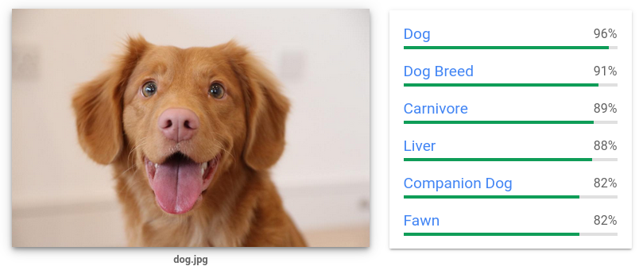
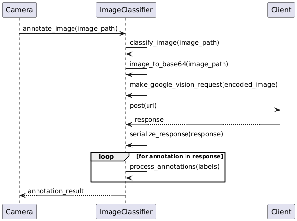
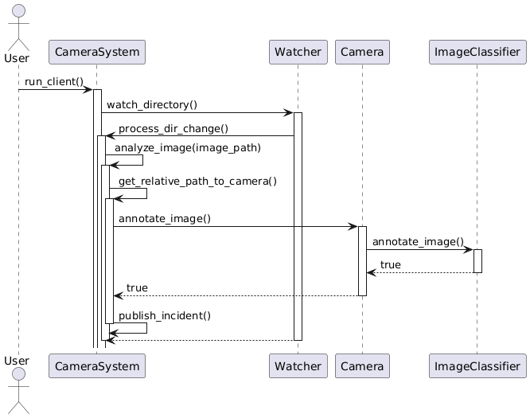

# Agregado Final: Reconocimiento de Imágenes

**Materia**: Taller de Programación.

Primer Cuatrimestre de 2024.

## Grupo: Rustic City Eye

### Integrantes

- Carranza, Lihuén.
- Demarchi, Ignacio.
- Giacobbe, Juan Ignacio.
- Saluzzi, Luca.

# Índice

1. [Introducción](#introducción)
2. [Proveedor de Infraestructura en la nube](#proveedor-de-infraestructura-en-la-nube)
    1. [Detalles y costos del proveedor](##detalles-y-costos-del-proveedor)
    2. [Uso del proveedor](##uso-del-proveedor)
3. [MultiThreading](#multithreading)
    1. [ThreadPool](##threadpool)
    2. [Sistema de Multithreading implementado](##sistema-de-multithreading-implementado)

# Introducción

Para este agregados, tuvimos que incorporar la tecnologia de reconocimiento de imagenes al sistema central de camaras desarrollado en nuestro proyecto de Agentes 
Autonomos de Prevencion. Esta tecnologia incorpora una inteligencia artificial que nos permite interpretar y comprender el contenido de imagenes digitales, utilizando algoritmos de aprendizaje automatico como las redes neuronales convolucionales, para identificar y clasificar objetos, y tambien para identificar caracteristicas visuales de nuestras imagenes.

Las aplicaciones de seguridad y vigilancia suelen servirse de esta tecnologia, debido a que podemos detectar ciertos eventos u objetos a traves de nuestros dispositivos de seguridad, y tomar medidas al respecto. Para nuestra aplicacion, tuvimos que hacer capaz al sistema central de camaras de procesar imagenes para detectar potenciales incidentes en la via publica(por ejemplo incendios, accidentes de transito, etc). Luego de detectar un incidente en las imagenes, el sistema de camaras debe hacer uso del sistema de mensajeria para publicar un mensaje que describa este incidente y, en consecuencia, generar el incidente correspondiente y poner en marcha el circuito de resolucion de incidentes implementado en el proyecto. 

# Proveedor de Infraestructura en la nube

Para servirnos de un modelo y una infraestructura previamente preprocesados y entrenados, utilizamos el servicio de [Vision AI](https://cloud.google.com/vision?hl=es_419) que nos provee Google. Este proveedor nos ofrece una capa de uso gratuito mas que suficiente para probar el trabajo realizado en una demostracion final en vivo, debido a que podemos hacer uso de la misma con una carga de procesamiento mediana(minimo de 10 requests por minuto).

## Detalles y costos del proveedor

## Uso del proveedor

En un principio, el usuario debe tener creado un proyecto en Google Cloud, y debe habilitar el servicio de Vision AI. Una vez generado, debe crear una API key para realizar las peticiones de usuario. Nuestro programa funciona si el usuario tiene seteada una variable de entorno `GOOGLE_API_KEY` con la key de su proyecto.

Para hacer peticiones de una forma ordenada al proveedor, hemos optado por declarar al struct [Image Classifier][surveilling::annotation::ImageClassifier] que se encarga de tomar las imagenes y hacer la peticion correspondiente para etiquetar a la imagen.

Para hacer uso del clasificador de imagenes, se debe proveer un url sobre el cual vamos a hacer nuestras peticiones, ademas de un path al archivo que contenga las palabras claves para detectar incidentes. La incorporacion de este archivo de palabras claves nos parece una buena decision para permitirle al usuario la definicion de sus propio set de palabras claves para definir incidentes.

Antes de avanzar, cabe destacar que el servicio de Vision AI tomara imagenes, y nos devolvera etiquetas sobre la misma, con un score determinado(este score nos dira que tan confiable es la etiqueta, obviamente esto depende del preprocesamiento y entrenamiento que Google hizo sobre el modelo). Aqui hay un ejemplo tomado de la pagina oficial:

En este caso, el modelo nos indica que la imagen contiene un perro(con un score de 0.96), y nos brinda mas caracteristicas sobre la misma. Para manejar mejor los resultados, la misma herramienta nos da la posibilidad de obtener la respuesta en formato JSON, lo cual nos parece mas acertado y comodo para trabajar con las peticiones, ya que vamos a hacer uso de los crates externos `serde` y `serde_json` para facilitar la serializacion y deserializacion de los documentos.

Para detectar incidentes, optamos por utilizar dos filtros que nos provee la API: `LABEL_DETECTION` y `SAFE_SEARCH_DETECTION`: la primera nos permite detectar etiquetas sobre la imagen, y la segunda nos permite detectar imagenes con contenido explicito(sirviendonos del detector que Google tiene integrado). Tambien, hemos modificado la cantidad maxima de resultados que nos da el modelo(por defecto son 10), y lo que hemos hecho fue setearlos con 50 resultados para label_detection, y con 10 para safe_search_detection.

El clasificador de imagenes que hemos declarado funciona de la siguiente manera para etiquetar las imagenes: se le provee un path hacia una imagen local, y se pasa a codificarla en base 64(haciendo uso del crate externo `Base64`), luego se realiza la request a la API, haciendo uso de un Client del crate externo `reqwest` en modo Blocking: esto nos permite manejar peticiones HTTP de manera sincronica, ya que va a bloquear el thread en ejecucion hasta que reciba una response. Las requests van a serializarse, y las responses van a deserializarse, obteniendo asi un vector de tuplas `(String, f64)`: el String corresponde a la etiqueta, y el f64 corresponde al score de esa etiqueta.

Al obtener el vector de etiquetas con sus respectivos scores, se pasa a detectar posibles incidentes, y es que si alguna de esas etiquetas contiene una palabra clave para detectar incidentes(puede ser por ejemplo la palabra `Fire`), se indica que un incidente fue detectado.  

# MultiThreading

## ThreadPool

Debido a la necesidad de emplear una estrategia de multithreading que nos permita ejecutar varias requests en paralelo, el equipo optó por implementar una ThreadPool. 
Una Threadpool es un mecanismo para manejar y ejecutar múltiples tareas de manera concurrente utilizando un grupo fijo de threads(el numero de threads es brindado por el usuario).

### Estructura de la Threadpool

1. ThreadPool

La estructura principal es ThreadPool, que contiene un vector de Workers y un sender de un canal mpsc.

    workers: Un vector que almacena los Workers que están disponibles para ejecutar tareas.
    sender: Permite enviar trabajos (Jobs) a los Workers.

2. Worker

Cada Worker es responsable de ejecutar los trabajos que recibe. Un Worker tiene un ID único y un thread que se ejecuta en un bucle esperando recibir trabajos.

    id: Identificador único del Worker.
    thread: El hilo en el que se ejecutan los jobs.

3. Job

Un Job es una tarea que se va a ejecutar en un thread. En nuestra implementación, se define como un alias de tipo (type) para un Box que contiene una función que toma la propiedad de sí misma (FnOnce), se puede enviar a través de threads (Send) y tiene una vida estática ('static).

### Uso de la ThreadPool

1. Creación de la ThreadPool: El método `new` de ThreadPool crea una nueva instancia del grupo de threads. Toma como parámetro el número de threads que se desean en el grupo.

2. Creación de un Worker: El método `new` de Worker toma un ID y un receptor de canal. Se crea un nuevo hilo que se ejecuta en un loop, esperando recibir jobs del canal. Cuando recibe un job, lo ejecuta.

3. Ejecución de tareas en la ThreadPool: El método `execute` en ThreadPool permite agregar nuevos jobs a la cola de tareas. Toma una función f que se ejecutará como una tarea en uno de los threads del grupo. También crea un canal interno para devolver el resultado de la ejecución.

## Sistema de Multithreading implementado

Se implementó un sistema mediante el cual, cuando se crea una nueva camara, se crea tambien un directorio asociada a esta. Con su ID como nombre del dir. Se desarrolló un Watcher que se encarga de monitorear un directorio en busca de nuevas imágenes. (el Watcher en cuestion tambien se utiliza para verificar la correcta creacion de directorios de camaras, las cuales se pueden verificar mediante el logging por consola).

Cuando se detecta una nueva imagen dentro de algun directorio de camaras se le envia mediante un channel la informacion de este evento al camera system, este luego spawnea un thread que se encarga de inicializar un clasificador y enviar a este la(s) imagen(es) para que este se encargue del etiquetado. 

Este diagrama de secuencia tiene como fin mostrar cómo se maneja la detección y análisis de cambios en los distintos directorios de las camaras dentro de nuestro sistema.

El proceso se da dentro del metodo función run_client en el CameraSystem. Este metodo del CameraSystem maneja la recepción y el procesamiento de diferentes mensajes reenviados por el cliente. Dependiendo del tipo de mensaje, se activan o desactivan las cámaras cercanas a la ubicación del incidente. Tambien en el se maneja un Watcher que esta pendiente a cambios dentro de los directorios de las distintas camaras del sistema: Este es capaz de encontrar nuevos directorios(los cuales son creados apenas se crea una camara nueva en la aplicacion), y tambien es capaz de detectar nuevos archivos en el mismo(cuando el usuario ingresa las imagenes que quiere que sean procesadas por las camaras).

### Threads dentro del metodo client_run

1. El primer hilo se encarga de ejecutar el cliente del CameraSystem (camera_system_client.client_run()).
2. El segundo hilo se dedica a recibir y procesar mensajes de incidentes y resoluciones de incidentes. Inicialmente, se define un Receiver que puede ser un parámetro opcional o el receptor del cliente del CameraSystem.
3. El tercer hilo se encarga de vigilar el directorio de imágenes. Utiliza una `ThreadPool` para gestionar los jobs de procesamiento de cambios en el directorio de camaras.
Se crea un canal para recibir eventos de cambios en el directorio(los cuales son notificados por el Watcher). En un loop infinito, este thread espera recibir eventos de cambios en el directorio. Cuando se detecta un cambio, se decide si el evento debe ser procesado en función del tiempo transcurrido desde el último evento similar.
Si se debe procesar el evento, se llama a process_dir_change para manejar el cambio de directorio).

Dentro de este metodo, se spawnean los threads Dentro de run_client y se llama a watch_directory, un método del Watcher, para iniciar la vigilancia del directorio de imágenes.

El Watcher monitorea el directorio en busca de cambios. Cuando se detecta un cambio en el directorio, dentro de process_dir_change, CameraSystem maneja el cambio de directorio llamando a `analyze_image` y pasando el path de la imagen a clasificar.

La función `analyze_image` es una parte fundamental del `CameraSystem` para la detección de incidentes utilizando la tecnologia de procesamiento de imágenes. Utiliza un `ThreadPool` para procesar las imágenes de forma asíncrona, lo que permite que el sistema maneje múltiples imágenes simultáneamente sin bloquear el flujo principal del programa. 

`analize_image` primero obtiene la cámara que debe evaluar la imagen, luego esta se encarga de clasificar la imagen(haciendo uso de su `ImageClassifier`) y luego publica los incidentes detectados. Este proceso asegura que las imágenes sean evaluadas rápidamente y que cualquier incidente detectado sea reportado de inmediato.

El método `annotate_image` de la cámara, a su vez, llama a `annotate_image` en su `ImageClassifier` para procesar la imagen. Una vez que el `ImageClassifier` termina de procesar la imagen, devuelve un valor booleano indicando que la anotación se detecto un incidente(`true`), o no(`false`).

Finalmente, si el CameraSystem recibe un true, llama a `publish_incident` para publicar el incidente correspondiente.

